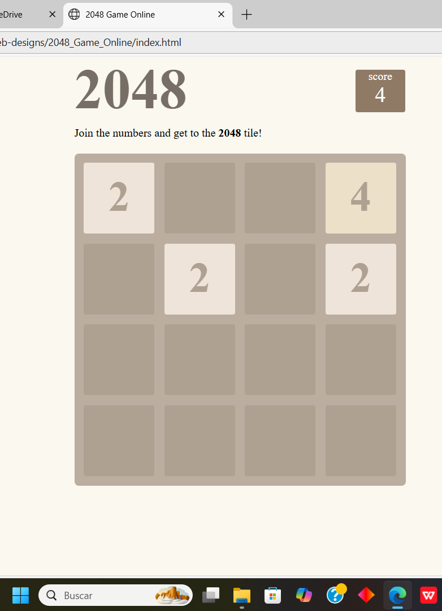
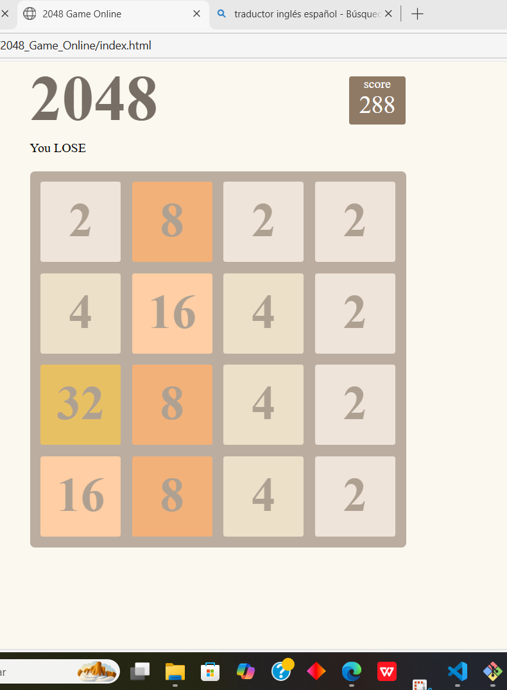

# 🚀 js-web-designs

Colección de **proyectos web interactivos** desarrollados con **JavaScript nativo**, HTML y CSS.  
Este repositorio funciona como **portafolio frontend**, mostrando distintos experimentos, juegos y diseños enfocados en lógica, UI y experiencia de usuario.

---

## 🧩 Proyectos incluidos

### 🎮 2048 Game Online
Implementación del clásico juego **2048** usando JavaScript puro.
- Movimiento con teclado
- Lógica completa del juego
- Diseño responsive
- Manipulación del DOM sin frameworks

📁 Carpeta: `2048_Game_Online/`

---

## 🛠️ Tecnologías utilizadas
- **JavaScript (Vanilla JS)**
- **HTML5**
- **CSS3**
- jQuery (en proyectos específicos)
- Manipulación del DOM
- Lógica de juegos y eventos

---

## 🎯 Objetivo del repositorio
- Practicar JavaScript sin frameworks
- Desarrollar proyectos funcionales y visuales
- Servir como **portafolio personal**
- Mostrar capacidad de resolución de problemas y lógica

---

## 📸 Capturas / Demo

